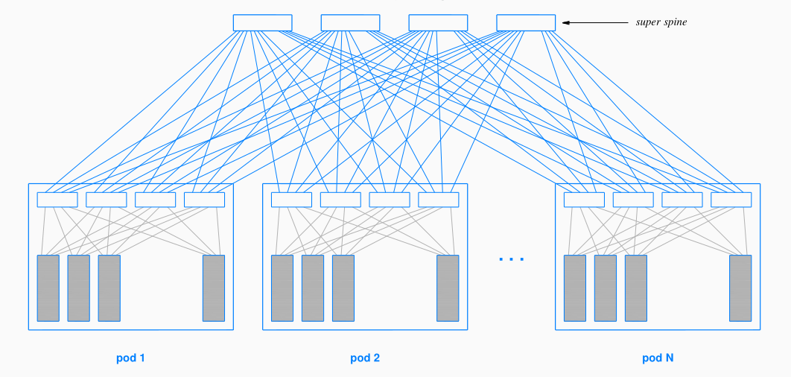
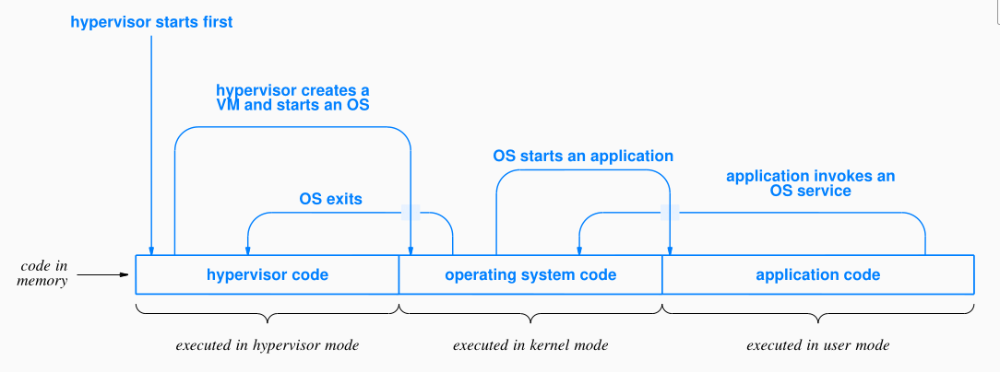
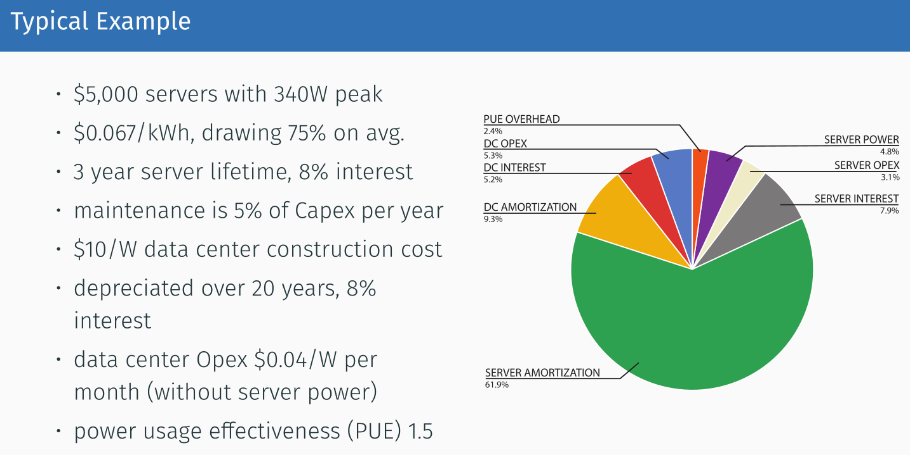

# Foundations

## Everything as a Service

- Infrastructure as a Service: renting hw
- Platform as a Service: dev and deployment framework (app engine)
- Software as a Service: gmail

## Data centers

- centralized compute facilities
- "compute center"

### Racks: set of servers squeezed into a small space

### Pod: set of racks servers

## Networking

- ethernet
- 10 gbit is standard, 40 gbit is common, 100 gbit available
- Top-of-Rack (ToR) switch
- Additional switches connecting ToRs

### Leaf-spine topology

- can survive death of spine switch
- can scale to more racks to some extent
  

## Virtualization

- Hypervisors allow virtualization of hardware
  
- good security isolation (better than container)
- performance isolation not perfect (better than container)
- split of HW resources
  - fair share (static)
  - competitive (dynamic)
  - token-bucket (overcommitting)

### Containers

- Lightweight, lower startup time
- Process isolation, better memory utilization
- Docker: namespace, cgroups, overlay file system

## Storage

### Virtual disks

- provisioned on demand
- elastic pricing
- allow stopping VM without losing data
- allow changing instance type (same virtual disk)

#### Implementation

- Network Attached Storage (NAS): reuses existing network
- Storage Area Network (SAN): separate network just for virt. storage
  - more predictable performance -> more expensive

## Functions as a Service

public cloud vendors offer a service to upload code (a function):
• exposed through http
• launched and scaled automatically by cloud provider

## Unikernels

we don't necessary require process isolation: in cloud often one service per VM
-> single address space OS

- examples: unikraft, osv, nanos

## Total cost of ownership (TCO)

- capital expenses (capex): facilities, compute, storage, networking
- operational expenses (opex): energy, maintenance, employees
- TCO = DC depreciation + DC opex + server depreciation + server opex
- example:
  
- server cost dominant, others are also significant
- on-premise vs. cloud
