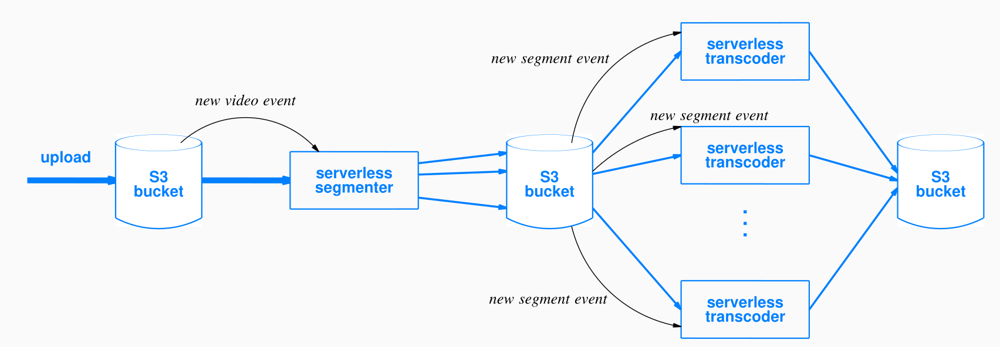
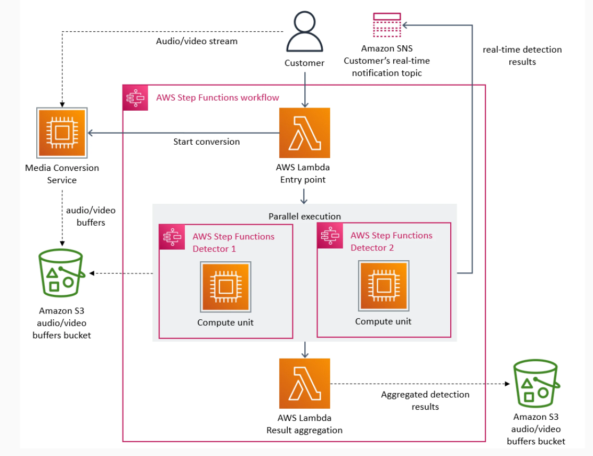
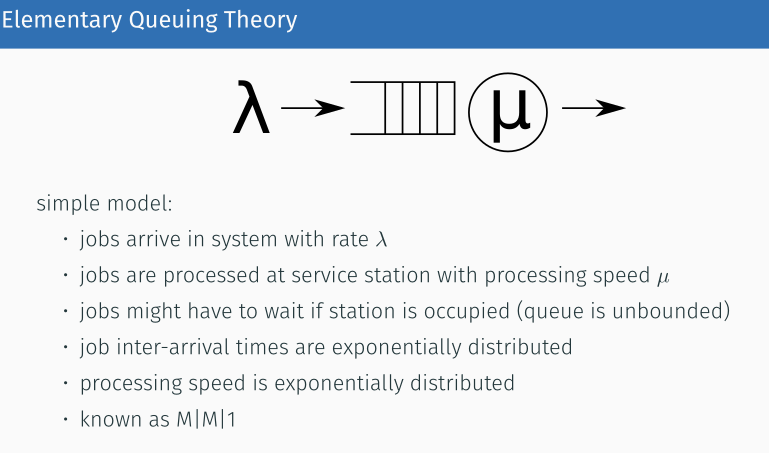

# Software Architecture for the Cloud

## Scalability

- vertical scaling (scale up): bigger machines (can be uneconomical in the cloud)
- horizontal scaling (scale out): more machines (works nicely for stateless)

### Scaling out and distributed systems

- too complex (paxos, raft)
- node failure
- network bottleneck
- Amdahl's law: non-parallelization fraction of workload **limits speedup**
- easy if workload and data can be **partitioned**
- **more failure modes**

#### Failure probability

- probability of an instance failure is p
- with n nodes: 1 - (1-p)^n
- for p = 0.01 = 1%, n = 10: 9.6% vs. 1% in single node

#### Failure modes

- fail stop (not true)
- network partitions
- transient failures (hard debugging)
- gray failures (performance, random packet loss etc.)

## Cloud Architecture Patterns

### Lift and Shift: on-premise to cloud with minimal changes

- partitioning (sharding)
- separation of compute and storage
- control panel (brain) and data plane (muscle)
  - control plane: coordination, scheduling, monitoring, cost counting
  - data plane: actual work
- microservices: suite of small services, running in own VMs/containers, commu vie network, each has own database, can use central database, contrasted with monoliths
  - best for cloud native
  - downsides: arch complexity, lots of network comm., complexity of distributed systems

#### Criteria microservices

- independent functionalities
- independent deployment
- different scaling needs
- different technology stack
- different development velocity and rate of change
- different levels of security and fault isolation
- different data isolation and compliance consideration
- resuability

## Video Stream Monitoring

### Video encoding

- FaaS, S3
  
- AWS Step functions
  
- serverless arch.
  - easy to run
  - scalability bottleneck: per-customer account limit
  - high cost
  - monolith might saves, should calculate the cost upfront and decide

## Wikipedia

- http cache
- 2 level load balancers
- app servers + session cache
- replications
- full text search
- services for monitoring and logging
- MariaDB

### lift and shift

- EC2 7.5M/year
- network cost 12M/year
- Budget: 146M/year, cost is reasonable
- move to cloud reduces employee cost

## Throughput and latency

- throughput: ops per time unit (improve by parallelism)
- latency: duration of one op (hard to measure and improve), improving throughput often makes latency worse

### Tail latency

- most are fast, small fraction are slow: io, cache miss, overload, failure etc.
- 95%, 99%, 99.99%
- parallel calls and wait for slowest, serial chain, quorum
  - improve: parallel (break into smaller ones), consolidation (merging steps), faster network

### Benchmarking

- measure throughput (record performance)
- measure latency is harder
- open vs. closed (easy, underestimates real world) benchmarking systems
  - open: request arrives independently of completions
  - closed: triggered by completion

### Remote calls and retries

- retry immediately: problem (spikes etc)
- jitter: random waiting time, exponential backoff
- Metastability: systemic failure: retries exacarbate the problem
  
