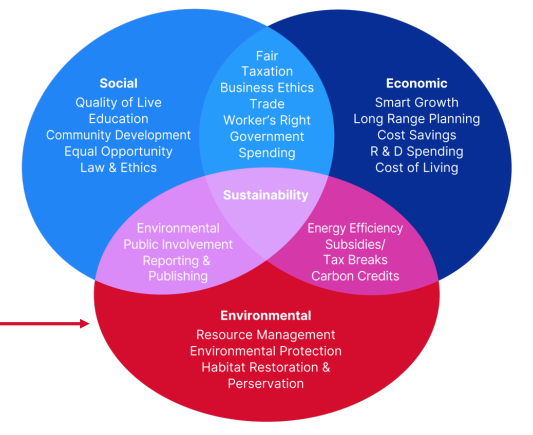

# Hetzner

german cloud service provider

- fiber optic ring: data centers in germany
- c-lion cable: 1100km, germany <-> finland, 15tbit/s

## Date center parks

- state-of-the-art data center parks
- redundant connections and UPS (Uninterruptible power supply), A/B concept
- direct free cooling (outside air), 340 days (98%) no active cooling

## Custom servers

- in-house product dev, qualification, testing, hw assembly, goods-in warehouse

## Automation

- automated server life cycle
  - test
  - install
  - wipe
- fast delivery
- vm startup ~6 sec

### block storage

- Ceph

### snapshot + backups

- backup scheduling
- object storage (AWS S3 compatible)

## Sustainability

### 3 Pillar

#### why it's important

- climate change
- energy transition
- digitalization and market growth
- legal requirements
- economic ambition
- social awareness
- motivation and initiative

### PUE: Power Usage Effectiveness

- total energy consumption of the data center/total energy consumption of the IT
- LOWER IS BETTER

#### at Hetzner: 1.10 - 1.16

- direct cooling/slanted roof building
- increase number of AC units
- replacement of AC unit fans and server fan
- location in countries with low temperature (Finland)
- enlargement of cross-section supply air inlet
