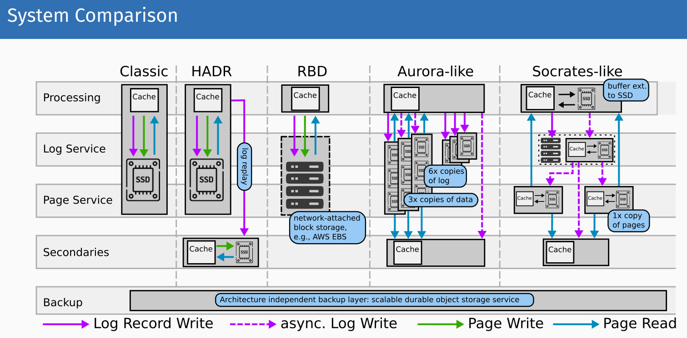

# State Management

- cloud promises elasticity and scalability
- stateful storage services/DBS -> sync points and bottleneck of scaling
- performance characteristics are not well documented (rarely by SLAs)
- performance determines whether and how to use a service and design cost efficient software architecture

## S3 Performance

- latency
  - seek: 30ms, scan: 50mb/s
- implementation
  - load balancer
  - api servers
  - metadata storage
  - object storage scale separately

### Database systems in the cloud

#### OLTP

- simple latency-critical queries
- many inserts, deletes, updates
- write optimized

classic dbms: B-tree, fixed size pages, cached in RAM, Write-ahead log

- PostgreSQL, MySQL

##### DynamoDB

- multi tenant distributed key/value store
- Create read update delete (CRUD)

##### Remote Block Device (RDB)

- virtual disks instead of instance storage-> durability
- higher cost

##### Primary/secondary design (high availability recover design (HADR))

- run 2 databases systems on 2 identical nodes

##### Amazon aurora

- disaggregates storage and compute

##### Microsoft Socrates

- log service: separate component
- each page only on one page server
  

#### OLAP

- mostly read + batch updates
- read optimized
- large table scan
- columnar

##### Traditional design

- horizontal partitioning by row (shared nothing)
- redshift

##### Modern: disaggregated storage and compute

- snowflake

##### QaaS: Query as a service

- large, multi tenant cluster
- disaggregated storage
- dynamic scheduling of queries

##### Analytic query processing using FaaS

- execute each query using lots of serverless functions
